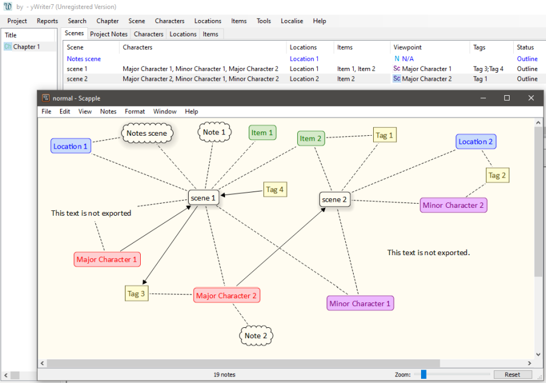

[yWriter](http://spacejock.com/yWriter7.html) is a free word processor written by Australian author and programmer Simon Haynes. 
[Scapple](https://www.literatureandlatte.com/scapple/overview) is a commercial free-form diagramming software for visualizing entities and relationships of all kinds. *Scappex* is a Python script that exports outlines made with Scapple to new yWriter projects.

## Features

- Notes with a shadow are converted to scenes in one single chapter.
- Notes with a "cloud" border and shadow are converted to "Notes" scenes.
- Notes with a "cloud" border without shadow are converted to scene and character notes.
- Notes with a square border are converted to tags.
- Notes with colored text are converted to characters, locations, or items.
- Connections between scenes and characters/locations/items are considered.
- If a yWriter project already exists, Character/Location/Item XML files are generated instead.
- The *scappex* release includes a sample Scapple file with note styles to import.

 
## Requirements

- [Python 3.6+](https://www.python.org).
- [yWriter 7](http://spacejock.com/yWriter7.html).
- [Scapple 1.2.6](https://www.literatureandlatte.com/scapple/overview).

## Download and install

[Download the latest release (version 0.13.3)](https://raw.githubusercontent.com/peter88213/scappex/main/dist/scappex_v0.13.3.zip)

- Unzip the downloaded zipfile "scappex_v0.13.3.zip" into a new folder.
- Move into this new folder and launch **setup.pyw**. This installs the script for the local user.
- Create a shortcut on the desktop when asked.
- Open "README.md" for usage instructions.

### Note for Linux users

Please make sure that your Python3 installation has the *tkinter* module. On Ubuntu, for example, it is not available out of the box and must be installed via a separate package. 

------------------------------------------------------------------

[Changelog](changelog)

## Usage

See the [instructions for use](usage)

## Credits

- Frederik Lundh published the [xml pretty print algorithm](http://effbot.org/zone/element-lib.htm#prettyprint).

## License

scappex is distributed under the [MIT License](http://www.opensource.org/licenses/mit-license.php).

 

