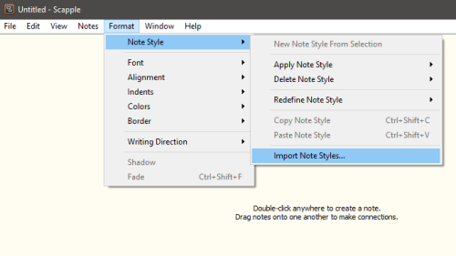

[Project homepage](https://peter88213.github.io/scappex)

------------------------------------------------------------------

The scappex Python script creates a yWriter 7 project from a Scapple outline.

## Instructions for use

### Intended usage

The included installation script prompts you to create a shortcut on the desktop. You can launch the program by dragging a *scap* file and dropping it on the shortcut icon. 

### Command line usage

Alternatively, you can

- launch the program on the command line passing the yWriter project file as an argument, or
- launch the program via a batch file.

usage: `scappex.pyw [--silent] Sourcefile`

#### positional arguments:

`Sourcefile` 

The path of the Scapple outline file.

#### optional arguments:

`--silent`  suppress error messages and the request to confirm overwriting

## Mode of operation

*Scappex* generates a new yWriter project file with the same file name as the Scapple source file, 
but with the extension `.yw`. It is placed in the same directory as the source file. 

However, **if the yWriter project already exists, it would not be overwritten**. Character/Location/Item 
XML files are generated instead. They can be imported into any yWriter project.

## Conversion rules

- Notes with a shadow are converted to scenes. 
- Notes with a shadow and "cloud" border are converted to "Notes" scenes. 
- Scenes are ordered by their position in the Scapple diagram (from top left to bottom right).
- Notes with a "cloud" border without shadow are converted to scene and character notes.
- Notes with a square border are converted to tags.
- Notes with red text are converted to major characters.
- Notes with purple text are converted to minor characters.
- Notes with blue text are converted to locations. 
- Notes with green text are converted to items.
- Assign characters/locations/items to a scene by connecting the corresponding notes.
- Assign tags to scenes/characters/locations/items by connecting the corresponding notes.
- Assign a viewpoint character to a scene by creating an arrow pointing from the character to the scene. If a scene is pointed to by several characters, or by no character, the viewpoint is random.

## How to mark notes for export

### Import styles (optional)

The scappex distribution comes with a sample Scapple project *styles.scap* including all required styles. You can either use this diagram as a template, or import the styles into your own Scapple diagram. 



In the file picker dialog, select `<unzipped scappex release folder>\sample\styles.scap`. Then you can apply the styles via context menu.


### Mark scenes

Either apply the "Scene" style, if any, via context menu, or tick "Shadow" in the Inspector to mark the note as scene.


To make the scene a "Notes" scene, either apply the "NotesScene" style, or make its border style "Cloud" in the Inspector.

### Mark notes

Either apply the "Note" style, if any, via context menu, or make the note's border style "Cloud" in the Inspector.

### Mark tags

Either apply the "Tag" style, if any, via context menu, or make the note's border style "Square" in the Inspector.

### Mark locations

Either apply the "Location" style, if any, via context menu, or tick the big blue field above the text color swatch in the Inspector.


### Mark major characters

Either apply the "Major character" style, if any, via context menu, or tick the big red field above the text color swatch in the Inspector.

### Mark minor characters

Either apply the "Minor character" style, if any, via context menu, or tick the big purple field above the text color swatch in the Inspector.

### Mark items

Either apply the "Item" style, if any, via context menu, or tick the big green field above the text color swatch in the Inspector.


## Custom configuration

You can override the default settings by providing a configuration file. Be always aware that faulty entries may cause program errors. 

### Global configuration

An optional global configuration file can be placed in the configuration directory in your user profile. It is applied to any project. Its entries override scappex's built-in constants. This is the path:
`c:\Users\<user name>\AppData\Roaming\PyWriter\scappex\config\scappex.ini`
  
The **install.bat** installation script installs a sample configuration file containing scappex's default values. You can modify or delete it. 

### Local project configuration

An optional project configuration file named `scappex.ini` can be placed in your project directory, i.e. the folder containing your yWriter and Timeline project files. It is only applied to this project. Its entries override scappex's built-in constants as well as the global configuration, if any.

### How to provide/modify a configuration file

The scappex distribution comes with a sample configuration file located in the `sample` subfolder. It contains scappex's default settings and options. This file is also automatically copied to the global configuration folder during installation. You best make a copy and edit it.

- The SETTINGS section mainly refers to colors, i.e. The text colors that mark the characters/locations/items in Scapple. If you change them, the program might behave differently than described in the description of the conversion rules below. 
- The OPTIONS section comprises options for regular program execution. 
- Comment lines begin with a `#` number sign. In the example, they refer to the code line immediately above.

This is the configuration explained: 

```
[SETTINGS]
location_color = 0.0 0.011765 1.0
# Blue

item_color = 0.058824 0.458824 0.011765
# Green

major_chara_color = 0.984314 0.015686 0.027451
# Red

minor_chara_color = 0.498039 0.015686 0.498039
# Purple

[OPTIONS]
export_scenes = Yes
export_characters = Yes
export_locations = Yes
export_items = Yes

```

## Installation path

The **install.bat** installation script installs *scappex.pyw* in the user profile. This is the installation path: 

`c:\Users\<user name>\AppData\Roaming\PyWriter\scappex`
    