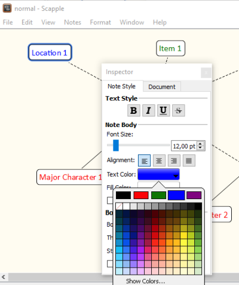

[Project homepage](https://peter88213.github.io/scappex)

------------------------------------------------------------------

The scappex Python script creates a yWriter 7 project from a Scapple outline.

## Instructions for use

### Intended usage

The included installation script prompts you to create a shortcut on the desktop. You can launch the program by dragging a csv file and dropping it on the shortcut icon. 

### Command line usage

Alternatively, you can

- launch the program on the command line passing the yWriter project file as an argument, or
- launch the program via a batch file.

usage: `scappex.pyw [--silent] Sourcefile`

#### positional arguments:

`Sourcefile` 

The path of the Scapple outline file.

#### optional arguments:

`--silent`  suppress error messages and the request to confirm overwriting


## Custom configuration

You can override the default settings by providing a configuration file. Be always aware that faulty entries may cause program errors. 

### Global configuration

An optional global configuration file can be placed in the configuration directory in your user profile. It is applied to any project. Its entries override scappex's built-in constants. This is the path:
`c:\Users\<user name>\AppData\Roaming\PyWriter\scappex\config\scappex.ini`
  
The **install.bat** installation script installs a sample configuration file containing scappex's default values. You can modify or delete it. 

### Local project configuration

An optional project configuration file named `scappex.ini` can be placed in your project directory, i.e. the folder containing your yWriter and Timeline project files. It is only applied to this project. Its entries override scappex's built-in constants as well as the global configuration, if any.

### How to provide/modify a configuration file

The scappex distribution comes with a sample configuration file located in the `sample` subfolder. It contains scappex's default settings and options. This file is also automatically copied to the global configuration folder during installation. You best make a copy and edit it.

- The SETTINGS section mainly refers to colors, i.e. The text colors that mark the characters/locations/items in Scapple. If you change them, the program might behave differently than described in the description of the conversion rules below. 
- The OPTIONS section comprises options for regular program execution. 
- Comment lines begin with a `#` number sign. In the example, they refer to the code line immediately above.

This is the configuration explained: 

```
[SETTINGS]
location_color = 0.0 0.011765 1.0
# Blue

item_color = 0.058824 0.458824 0.011765
# Green

major_chara_color = 0.984314 0.015686 0.027451
# Red

minor_chara_color = 0.498039 0.015686 0.498039
# Purple

[OPTIONS]
export_scenes = Yes
export_characters = Yes
export_locations = Yes
export_items = Yes

```

## Conversion rules

The column labels refer to the example timeline "Murder on the Orient Express". 

- Notes with a shadow are converted to regular scenes. Tick "Shadow" in the Inspector to mark the note as scene.
  
- Notes with red text are converted to major characters. Tick the big red field above the text color swatch in the Inspector.
- Notes with purple text are converted to minor characters. Tick the big purple field above the text color swatch in the Inspector.
- Notes with blue text are converted to locations. Tick the big blue field above the text color swatch in the Inspector.
  
- Notes with green text are converted to items. Tick the big green field above the text color swatch in the Inspector.
- Assign characters/locations/items to a scene by connecting the corresponding notes.
- Assign a viewpoint character to a scene by creating an arrow pointing from the character to the scene. It a scene is pointed to by several characters, or by no character, the viewpoint is random.


## Installation path

The **install.bat** installation script installs *scappex.pyw* in the user profile. This is the installation path: 

`c:\Users\<user name>\AppData\Roaming\PyWriter\scappex`
    